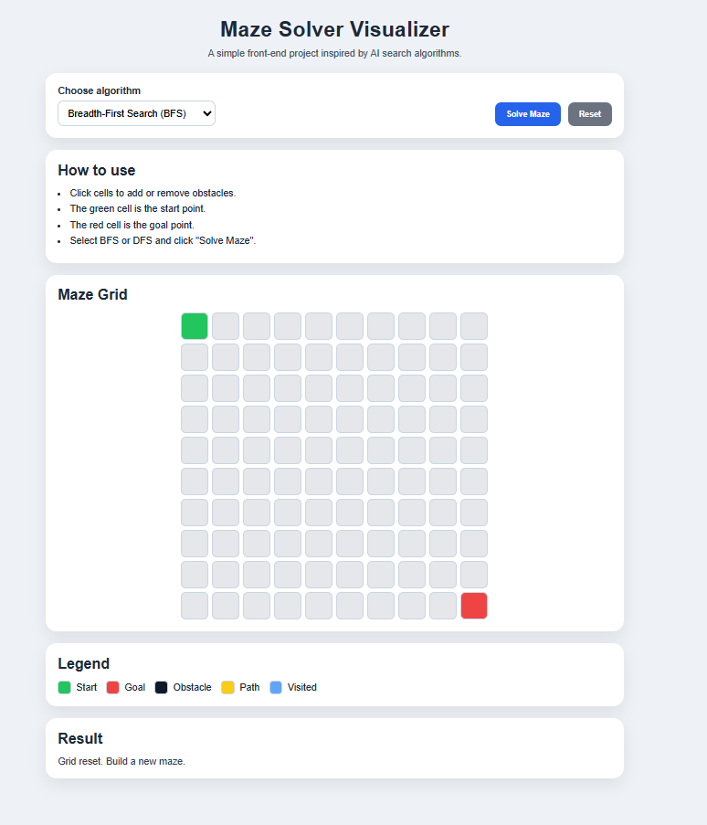
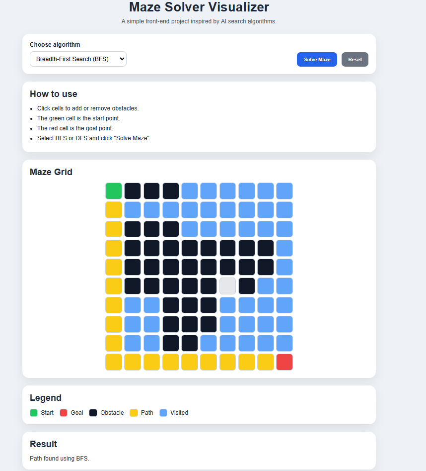
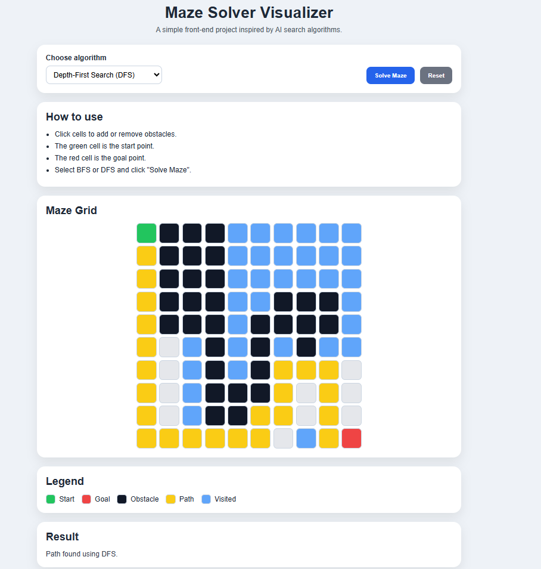

> Built as part of my journey into AI and algorithm visualization.

# 🧠 Maze Solver Visualizer

An interactive web application that visualizes how classic AI search algorithms (BFS & DFS) find a path in a maze.

---

## 🚀 Live Demo

👉 [View the app](https://devcodemate.github.io/maze-solver-visualizer/)

---

## 💻 Repository

👉 [View source code](https://github.com/devcodemate/maze-solver-visualizer)

---

## 📸 App Preview

### 🟢 Initial State

### 🟡 Path Found (BFS)

### 🔵 DFS vs BFS Comparison

---

## 🧩 Project Overview

This project demonstrates how search algorithms explore a grid to find a path from a starting point to a goal.

The user can:
- Add or remove obstacles
- Choose between BFS and DFS
- Visualize how the algorithm explores the maze
- See the final path clearly highlighted

---

## ⚙️ How It Works

1. The grid represents the environment
2. The green cell is the start point
3. The red cell is the goal
4. Obstacles can be placed manually
5. The algorithm explores the grid:
   - 🔵 Blue = visited nodes
   - 🟡 Yellow = final path

---

## 🚀 Features

- Interactive grid system
- BFS (Breadth-First Search)
- DFS (Depth-First Search)
- Real-time visualization
- Path highlighting
- Reset functionality
- Clean UI

---

## 🛠️ Technologies

- HTML
- CSS
- JavaScript

---

## 📦 Example Input

Maze with obstacles manually placed by the user.

---

## 📊 Example Output

- BFS finds the shortest path
- DFS explores deeper paths first
- Visual feedback through colors

---

## 🧠 Concepts Applied

- AI Problem Solving
- Graph Traversal
- BFS vs DFS
- State Space Exploration
- Pathfinding logic

---

## 🔮 Future Improvements

- Animation step-by-step visualization
- Speed control
- A* Algorithm integration
- Mobile optimization
- Save/load maze feature

---

## 👩‍💻 Author

<CodeMate> — Building the future, one line at a time 🚀
